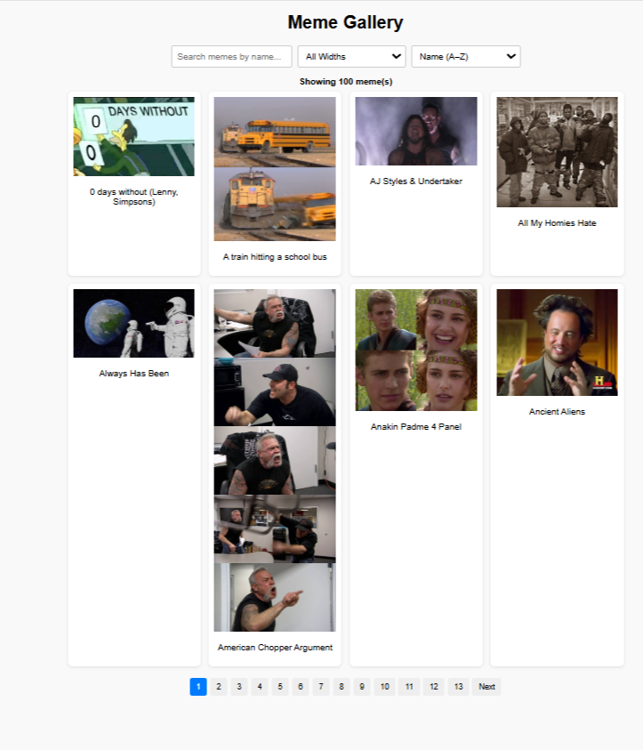

# Meme Gallery

A simple and interactive meme gallery web app that fetches popular memes from the Imgflip API. Users can search, filter by width, sort, and paginate through memes easily.

🌐 **Live Link:** [https://neelsamel23.github.io/Meme_Gallery/](https://neelsamel23.github.io/Meme_Gallery/)

---

## 🚀 Features

- Fetches meme data dynamically from [Imgflip API](https://api.imgflip.com/get_memes)
- Search memes by name (case-insensitive)
- Filter memes based on image width (`<300px`, `300-500px`, `>500px`)
- Sort memes by name (A-Z), width ascending, or width descending
- Pagination with next, previous, and page numbers
- Responsive and user-friendly UI
- Loading state while fetching data
- Graceful error handling if API request fails

---

## 📁 Project Structure

Meme_Gallery/
│
├── index.html          # Main HTML file
├── styles.css          # CSS styles (if applicable)
├── script.js           # JavaScript code with API fetching and gallery logic
└── README.md           # This file

## 🧰 Technologies Used

- HTML5  
- CSS3  
- Vanilla JavaScript (ES6+)  
- Imgflip Meme API ([https://api.imgflip.com/get_memes](https://api.imgflip.com/get_memes)) 

## 📦 How to Run Locally

🚀 Getting Started

1. Clone the Repository
git clone [https://github.com/neelsamel23/Movies_Gallery.git](https://github.com/NEELSAMEL23/Meme_Gallery.git)
cd Meme_Gallery

3. Run the Project Locally
🖥️ If you're using VS Code:

Open the folder in VS Code:

code .
Open index.html manually or via the Explorer.

Press Alt + L followed by Alt + O
(This opens the file with the Live Server extension — make sure it’s installed).

📸 Project Preview

🧾 License
This project is licensed under the MIT License.
See the LICENSE file for details.

🙋‍♂️ Author
Neel Samel
GitHub: @neelsamel23
